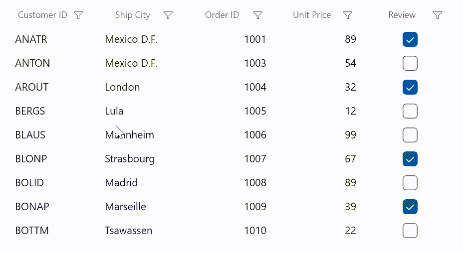

# How to change the cell value of selected cells in WinUI DataGrid (SfDataGrid)?

You can select multiple cells by setting [SelectionUnit](https://help.syncfusion.com/cr/winui/Syncfusion.UI.Xaml.DataGrid.SfDataGrid.html#Syncfusion_UI_Xaml_DataGrid_SfDataGrid_SelectionUnit) as [Cell](https://help.syncfusion.com/cr/winui/Syncfusion.UI.Xaml.Grids.GridSelectionUnit.html#Syncfusion_UI_Xaml_Grids_GridSelectionUnit_Cell) or [Any](https://help.syncfusion.com/cr/winui/Syncfusion.UI.Xaml.Grids.GridSelectionUnit.html#Syncfusion_UI_Xaml_Grids_GridSelectionUnit_Any) and [SelectionMode](https://help.syncfusion.com/cr/winui/Syncfusion.UI.Xaml.Grids.SfGridBase.html#Syncfusion_UI_Xaml_Grids_SfGridBase_SelectionMode) as [Multiple](https://help.syncfusion.com/cr/winui/Syncfusion.UI.Xaml.Grids.GridSelectionMode.html#Syncfusion_UI_Xaml_Grids_GridSelectionMode_Multiple) or [Extended](https://help.syncfusion.com/cr/winui/Syncfusion.UI.Xaml.Grids.GridSelectionMode.html#Syncfusion_UI_Xaml_Grids_GridSelectionMode_Extended) in [WinUI DataGrid](https://www.syncfusion.com/winui-controls/datagrid) (SfDataGrid). You can edit and change the value of all the selected cells when editing completes by handling [CurrentCellEndEdit](https://help.syncfusion.com/cr/winui/Syncfusion.UI.Xaml.DataGrid.SfDataGrid.html#Syncfusion_UI_Xaml_DataGrid_SfDataGrid_CurrentCellEndEdit) event in **DataGrid**.

You have to set a value for all the selected cells in the **CurrentCellEndEdit** event as shown in the below code snippet. If the current cell property type is not matched with the selected cell type, then you have to convert the value to the associated type of respective cells.

```C#

//Event subscription
dataGrid.CurrentCellEndEdit += OnCurrentCellEndEdit;

//Event customization
void OnCurrentCellEndEdit(object sender, CurrentCellEndEditEventArgs args)
{
      //Get DataGrid
      var dataGrid = sender as SfDataGrid;

      if (dataGrid != null)
      {
          //Get the collection of SelectedCells using GetSelectedCells helper method
          var selectedcells = dataGrid.GetSelectedCells();

          if (selectedcells != null && dataGrid.View != null)
          {
              var propertyAccessProvider = dataGrid.View.GetPropertyAccessProvider();
              
              var itemProperties = dataGrid.View.GetItemProperties();

              if (propertyAccessProvider != null && itemProperties != null)
              {
                  if (dataGrid.CurrentItem != null && dataGrid.CurrentColumn != null && dataGrid.CurrentColumn.MappingName != null)
                  {
                      //Get the edited value in CurrentItem property
                      var newValue = propertyAccessProvider.GetValue(dataGrid.CurrentItem, dataGrid.CurrentColumn.MappingName);

                      //Check the selectedcells have 0r not
                      if (selectedcells.Count > 0)
                      {
                          try
                          {
                              selectedcells.ForEach(item =>
                              {
                                  var cellInfo = item as GridCellInfo;
                                  var propInfo = itemProperties.Find(cellInfo.Column.MappingName, true);
                                  if (propInfo != null && propInfo.PropertyType == newValue.GetType())
                                      propertyAccessProvider.SetValue(cellInfo.RowData, cellInfo.Column.MappingName, newValue);
                                  else if (propInfo != null)
                                  {
                                      var value = Convert.ChangeType(newValue, propInfo.PropertyType);
                                      propertyAccessProvider.SetValue(cellInfo.RowData, cellInfo.Column.MappingName, value);
                                  }
                              });
                          }
                          catch (Exception e)
                          {
                              Debug.WriteLine(e.Message);
                          }
                      }
                  }
              }
          }
      }
}

```


